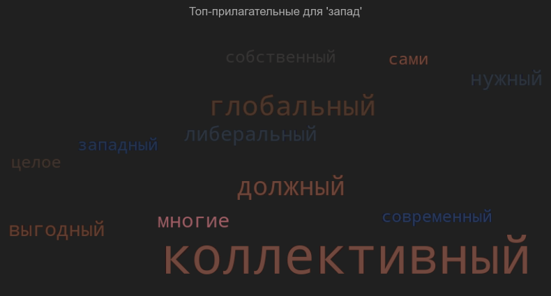

# 🧠 AI + Political Analysis Lab

  

Welcome to my personal lab at the intersection of political analysis and artificial intelligence.

This repository documents my transition from international affairs to the application of AI for political modeling, discourse analysis, and the study of hybrid conflict and digital propaganda.

---

## 🧭 Project: Narratives of Identity and Loyalty — NLP-Based Discourse Analysis of Russian Psychological Warfare

This project investigates how Russian pro-government Telegram channels manipulate concepts of identity, loyalty, and belonging through targeted narratives and propaganda techniques. By combining state-of-the-art natural language processing (NLP) and machine learning tools, I analyze rhetorical strategies aimed at delegitimizing dissent, shaping public perception, and constructing flexible definitions of “Russianness.”

---

### Key Features

- **Data**: ~20,000 posts collected from Russian pro-government Telegram channels (Spring 2025).
- **Methods**: Text preprocessing, clustering, topic modeling, transformer-based classification, and visualization.
- **Research questions**:
  - How is national identity linguistically reconstructed in Russian pro-regime digital discourse?
  - What patterns of psychological warfare target dissenting or exiled Russians?
  - How do contradictions between imperial, nationalist, and anti-elitist rhetoric manifest in language?
  - Can AI-driven analysis expose the regime’s narrative vulnerabilities?

---

## 🧩 Project Highlights

### 1. Word Clouds of Key Concepts

- Visualizations for the most common adjectives used with "Russian", "people", and "the West" in pro-government channels:

  

  | "West"                               | "People"                                 | "Russian"                                  |
  |---------------------------------------|------------------------------------------|--------------------------------------------|
  |    |   |   |

  

### 2. Clustering of Narrative Themes

- Topic clusters show how propaganda discourse is structured around themes such as military valor, ideological justification, and identity narratives.

  

  
  

### 3. Detection of Logical Fallacies

- Transformer-based classification reveals the prevalence of manipulative argumentation, including emotional appeals and circular reasoning.

  

  
  

---

## ⚒️ Technologies & Tools

- **Languages**: Python
- **Libraries**: NLTK, spaCy, HuggingFace Transformers, sklearn, pandas, UMAP, KMeans
- **Visualization**: Matplotlib, Seaborn, WordCloud, Plotly

---

## 🚩 Key Insights

- Pro-regime channels weaponize language to construct ambiguous and exclusionary definitions of national identity.
- Emotional, adversarial, and contradictory rhetoric is prevalent, reflecting both deliberate psychological tactics and ideological confusion.
- Automated discourse analysis can reveal the structure and tactics of digital propaganda, informing further research on authoritarian narrative control.

---

## 📈 Future Directions

- Expand analysis to time-series tracking of narratives and reaction to political crises.
- Compare with independent and opposition media.
- Refine typology of psychological manipulation techniques in digital authoritarian contexts.

---

## 👨‍💻 Author

**Yury Terekhov**  
Visiting Scholar at PRIF | Former Kennan Institute Fellow  
Exploring the future of tech & geopolitics.

---

## 📄 References

- Tuan Nguyen et al., [Propaganda techniques classification (2019)](https://github.com/tuantnguyen1/Propaganda_Detection)
- NLTK Documentation ([nltk.org](https://www.nltk.org/))
- HuggingFace Logical Fallacy Models ([huggingface.co](https://huggingface.co/))
