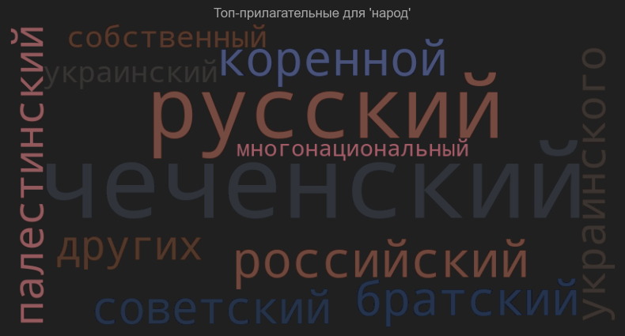
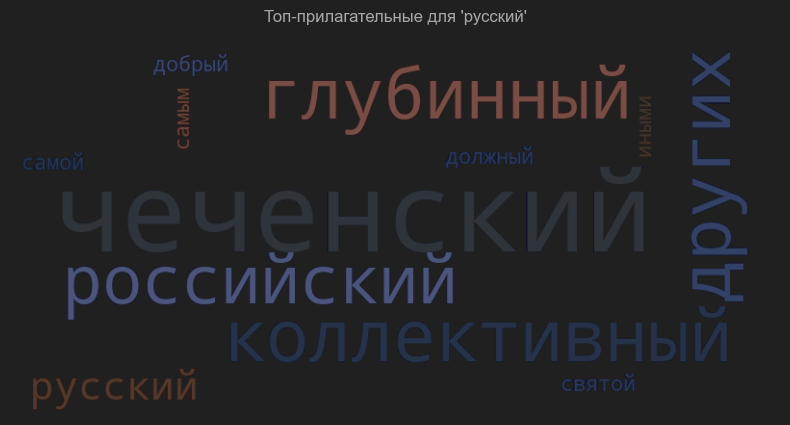
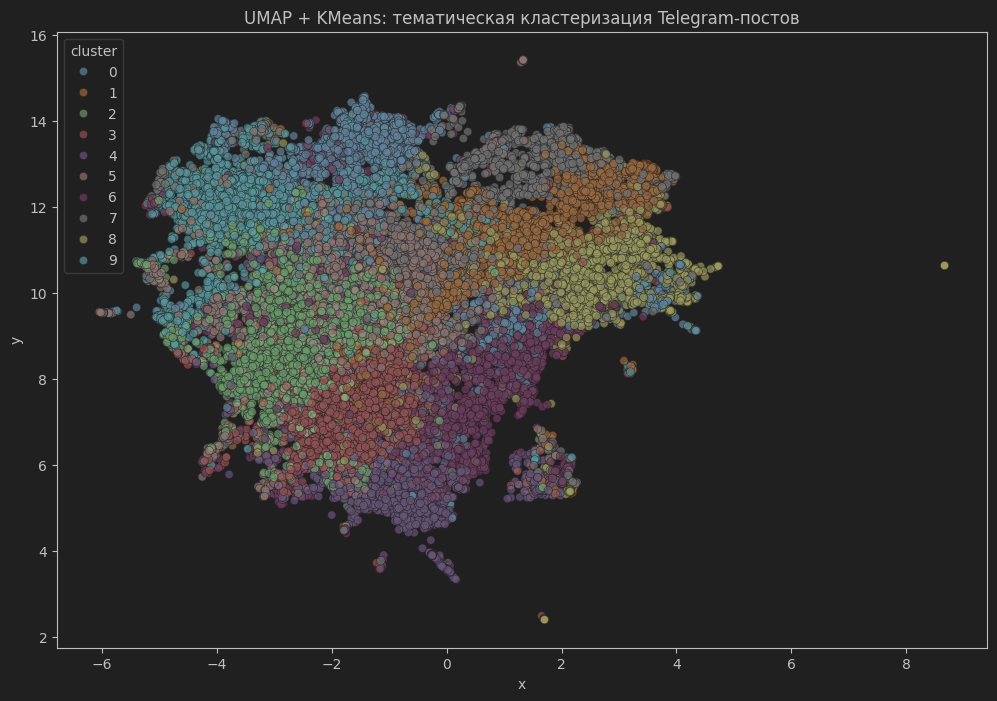

# NLP-Based Analysis of Propaganda Narratives and Identity in Russian Pro-Government Telegram Channels

**Author**: Yury Terekhov  
**Date**: May 2025

---

## Abstract

This report presents a natural language processing (NLP) study of propaganda techniques, rhetorical patterns, and identity construction in Russian pro-government Telegram channels. Using modern topic modeling, clustering, word cloud visualization, and transformer-based classification, the project identifies how national concepts and propaganda logic are embedded in routine digital discourse. The results offer both analytical insight and a reproducible toolkit for similar research at the intersection of AI and political analysis.

---

## 1. Introduction

The Russian information space is a key battleground for the contestation of identity and loyalty, particularly in periods of political crisis. Pro-government Telegram channels play a leading role in constructing and broadcasting ideological narratives, mobilizing support, and delegitimizing alternative viewpoints. This project explores the core rhetorical and narrative mechanisms at work in this ecosystem using state-of-the-art NLP techniques.

---

## 2. Data Collection

- **Sources**: Russian pro-government Telegram channels (e.g., @Agdchan, @voenkorKotenok, @sashakots, @wargonzo, etc.).
- **Volume**: ~20,000 posts collected (April–May 2025).
- **Format**: Data saved as CSV and JSONL for compatibility with NLP pipelines.

---

## 3. Data Preprocessing

- Removal of duplicates, non-textual noise, and irrelevant entries.
- Normalization and tokenization using Russian NLP libraries (NLTK, spaCy).
- Russian stopwords filtering for accurate frequency analysis.

---

## 4. Exploratory Analysis: Visualizing Identity Narratives

To capture the evaluative and associative framing of key identity terms, word clouds were generated for adjectives commonly paired with:

- **"Запад" ("the West")**
  
  

- **"Народ" ("people")**
  
  

- **"Русский" ("Russian")**
  
  

**Findings:**  
These word clouds reveal recurrent patterns of opposition (e.g., “collective West,” “liberal,” “global”) and identity (e.g., “Chechen,” “Russian,” “multinational,” “Soviet,” “bratsky” [brotherly]). Emotional and ideological qualifiers highlight the way “the West” is framed as collective, modern, or threatening, while “people” and “Russian” are frequently described in ethno-national or civilizational terms.

---

## 5. Topic Modeling and Clustering

- **Embedding**: Posts were embedded with transformer models (LaBSE, ruBERT).
- **Clustering**: UMAP for dimensionality reduction, KMeans for cluster assignment (k=10).
- **Visualization**: The distribution of topics across the dataset is visualized below.

  

**Findings:**  
Distinct clusters correspond to themes such as military valor, ideological justification, civilizational narratives, critique of “the West,” historical analogies, and mobilization rhetoric.

---

## 6. Logical Fallacies Detection

To identify manipulative argumentation, a transformer-based classifier (fine-tuned on logical fallacy detection) was applied to the posts. The normalized distribution of most frequent logical fallacies is shown below.

  

**Findings:**  
- **Circular claims**, **appeals to emotion**, and **false dilemmas** are the most prominent logical fallacies in the discourse.
- Other frequent patterns include fallacies of credibility, causality, extension, and ad hominem.
- These rhetorical devices are used to reinforce loyalty, delegitimize opposition, and mask internal contradictions in official narratives.

---

## 7. Key Insights

- **Identity narratives are built through selective attribution of positive and negative qualities to both in-groups and out-groups.**
- **Propaganda employs a mixture of emotional appeals, pseudo-rational logic, and ideological ambiguity.**
- **Clustering reveals that rhetorical patterns are closely tied to specific narrative themes and moments of political crisis.**

---

## 8. Limitations

- The dataset is limited to Telegram channels; broader media analysis may yield additional insights.
- Automated detection of fallacies is limited by training data and language nuance, especially in Russian.
- Further temporal analysis could reveal how narrative tactics shift in response to political events.

---

## 9. Conclusion

NLP and AI-based tools can significantly advance the analysis of propaganda and identity discourse in digital authoritarian environments. The workflow developed here is open for adaptation to other political contexts and research questions.

---

## 10. References

- [Tuan Nguyen et al., Propaganda techniques classification (2019)](https://github.com/tuantnguyen1/Propaganda_Detection)
- [NLTK Documentation](https://www.nltk.org/)
- [HuggingFace Logical Fallacy Models](https://huggingface.co/)
- Author: Yury Terekhov

---

